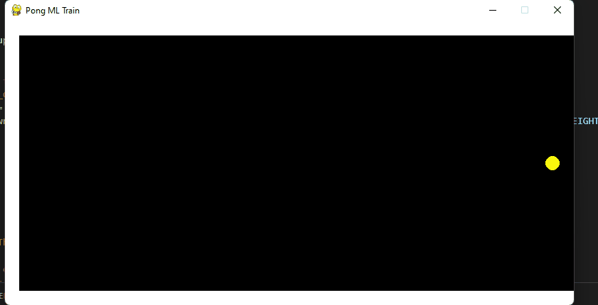

# MinimalPongGame

# Lab 2

# Lab 3

# Lab 4

Model Chosen: Linear Regression

I choose to do a simple Linear Regression model for this lab as all that really needs to be done is predicting a y-value for the paddle to be at that coincides with the y-value the ball is at during the game when they approach the same x-value so Linear Regression came to mind instantly

Group Member(s): Angel LaVoie